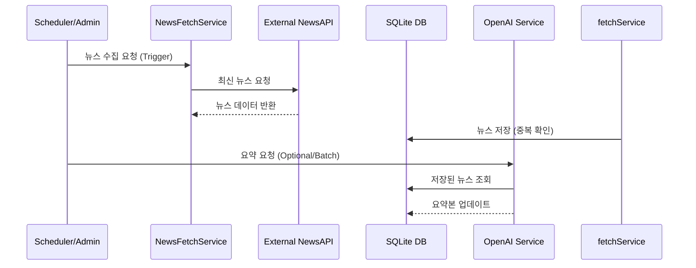

# 시스템 아키텍처 (System Architecture)

## 🏗️ 개요

News Curation 프로젝트는 **Next.js App Router**를 기반으로 한 모던 웹 애플리케이션입니다. 클린 아키텍처(Clean Architecture)의 원칙을 일부 차용하여 관심사를 분리하고 유지보수성을 높였습니다.

## 🛠️ 기술 스택 (Tech Stack)

| 영역 | 기술 | 설명 |
|------|------|------|
| **Core** | Next.js 16 (App Router) | React 프레임워크, 서버 사이드 렌더링 및 API 라우트 지원 |
| **Language** | TypeScript | 정적 타입 시스템을 통한 안정성 확보 |
| **Database** | SQLite (Better-SQLite3) | 경량화된 파일 기반 관계형 데이터베이스 |
| **AI** | OpenAI GPT-4o-mini | 뉴스 요약 및 인사이트 도출 |
| **Styling** | CSS Modules | 컴포넌트 단위 스타일링 |
| **Testing** | Vitest | 유닛 및 통합 테스트 |

## 📂 디렉토리 구조 (Directory Structure)

```
app/src/
├── app/                    # Next.js App Router (페이지 및 API 엔드포인트)
│   ├── api/               # 백엔드 API Routes
│   ├── layout.tsx         # 루트 레이아웃
│   └── page.tsx           # 메인 페이지
│
├── domain/                # 도메인 계층 (비즈니스 로직의 핵심)
│   └── entities/          # 핵심 데이터 모델 (News, Category 등)
│
├── application/           # 애플리케이션 계층 (유스케이스)
│   └── services/          # 비즈니스 로직 처리 (NewsFetchService, AISummaryService 등)
│
├── infrastructure/        # 인프라스트럭처 계층 (외부 시스템 통신)
│   ├── api/               # 외부 API 클라이언트 (NewsAPI, SearchApi 등)
│   ├── database/          # 데이터베이스 연결 및 설정
│   └── repositories/      # 데이터 접근 객체 (Repository Pattern)
│
└── components/            # 프레젠테이션 계층 (UI 컴포넌트)
    ├── common/            # 공통 컴포넌트
    └── ...
```

## 🔄 데이터 흐름 (Data Flow)

### 뉴스 수집 및 요약 프로세스



## 🧩 주요 컴포넌트 설명

### 1. Domain Layer
비즈니스 규칙과 핵심 엔티티를 정의합니다. 외부 의존성이 없어야 합니다.
- `News`: 뉴스 기사 객체 정의
- `Category`: 뉴스 카테고리 정의

### 2. Application Layer
비즈니스 로직을 수행합니다. 도메인 객체를 사용하여 작업을 처리합니다.
- `NewsFetchService`: 외부 뉴스 API에서 뉴스를 가져와 저장하는 로직
- `AISummaryService`: 뉴스 본문을 GPT를 통해 요약하는 로직

### 3. Infrastructure Layer
데이터베이스, 외부 API 등 구체적인 기술 구현을 담당합니다.
- `Sqlite`: 데이터베이스 연결 관리
- `NewsRepository`: DB 쿼리 실행 및 데이터 매핑
- `NewsApiClient`: 외부 NewsAPI 통신 담당
