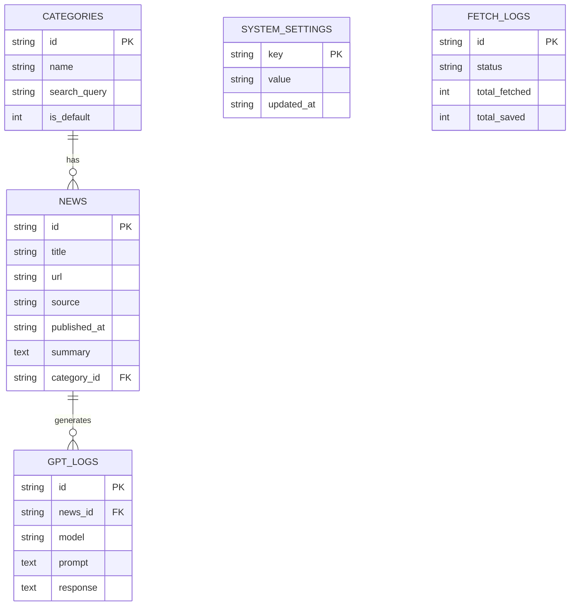

# 데이터베이스 스키마 (Database Schema)

## 🗄️ 개요
이 프로젝트는 **SQLite**를 사용하여 데이터를 로컬 파일(`data/news.db`)에 저장합니다. `better-sqlite3` 라이브러리를 통해 데이터베이스와 상호작용합니다.

## 📊 ER 다이어그램 (ER Diagram)

## 📋 테이블 명세

### 1. categories
뉴스 카테고리 정보를 저장합니다.

| 컬럼명 | 데이터 타입 | 설명 | 제약조건 |
|--------|------------|------|----------|
| `id` | TEXT | 카테고리 고유 ID | PK |
| `name` | TEXT | 카테고리 이름 (예: 기술, 과학) | NOT NULL, UNIQUE |
| `search_query` | TEXT | 뉴스 검색 시 사용할 쿼리 키워드 | NOT NULL |
| `is_default` | INTEGER | 기본 카테고리 여부 (0: False, 1: True) | DEFAULT 0 |
| `created_at` | TEXT | 생성 일시 (ISO 8601) | NOT NULL |

### 2. news
수집된 뉴스 기사 정보를 저장합니다.

| 컬럼명 | 데이터 타입 | 설명 | 제약조건 |
|--------|------------|------|----------|
| `id` | TEXT | 뉴스 고유 ID (UUID) | PK |
| `title` | TEXT | 뉴스 제목 | NOT NULL |
| `url` | TEXT | 원본 기사 URL | NOT NULL, UNIQUE |
| `source` | TEXT | 뉴스 출처 (신문사 등) | NOT NULL |
| `published_at` | TEXT | 발행 일시 | NOT NULL |
| `summary` | TEXT | AI 요약 내용 | NULLABLE |
| `image_url` | TEXT | 썸네일 이미지 URL | NULLABLE |
| `category_id` | TEXT | 해당 기사의 카테고리 ID | FK (categories.id) |
| `created_at` | TEXT | 수집 일시 | NOT NULL |

### 3. system_settings
시스템 설정 값을 Key-Value 형태로 저장합니다.

| 컬럼명 | 데이터 타입 | 설명 | 제약조건 |
|--------|------------|------|----------|
| `key` | TEXT | 설정 키 (예: CRON_SCHEDULE) | PK |
| `value` | TEXT | 설정 값 | NOT NULL |
| `updated_at` | TEXT | 마지막 수정 일시 | NOT NULL |

### 4. gpt_logs
GPT API 호출 기록을 저장하여 비용 및 오류를 추적합니다.

| 컬럼명 | 데이터 타입 | 설명 | 제약조건 |
|--------|------------|------|----------|
| `id` | TEXT | 로그 ID | PK |
| `created_at` | TEXT | 호출 일시 | NOT NULL |
| `model` | TEXT | 사용된 모델명 (예: gpt-4o-mini) | NOT NULL |
| `prompt` | TEXT | 	전송된 프롬프트 | NOT NULL |
| `response` | TEXT | 응답받은 텍스트 | NULLABLE |
| `tokens_input` | INTEGER | 입력 토큰 수 | NULLABLE |
| `tokens_output` | INTEGER | 출력 토큰 수 | NULLABLE |
| `duration_ms` | INTEGER | 소요 시간 (ms) | NULLABLE |
| `news_id` | TEXT | 관련 뉴스 ID | NULLABLE |
| `status` | TEXT | 성공/실패 상태 | NOT NULL |
| `error_message` | TEXT | 에러 발생 시 메시지 | NULLABLE |

### 5. fetch_logs
뉴스 수집 작업의 실행 기록을 저장합니다.

| 컬럼명 | 데이터 타입 | 설명 | 제약조건 |
|--------|------------|------|----------|
| `id` | TEXT | 로그 ID | PK |
| `created_at` | TEXT | 실행 일시 | NOT NULL |
| `status` | TEXT | 성공/실패 상태 | NOT NULL |
| `duration_ms` | INTEGER | 소요 시간 (ms) | NULLABLE |
| `total_fetched` | INTEGER | 가져온 전체 뉴스 수 | NULLABLE |
| `total_saved` | INTEGER | 새로 저장된 뉴스 수 | NULLABLE |
| `total_duplicates`| INTEGER | 중복 제외된 뉴스 수 | NULLABLE |
| `category_results`| TEXT | 카테고리별 결과 (JSON) | NULLABLE |
| `error_message` | TEXT | 에러 메시지 | NULLABLE |

### 6. search_api_logs
검색 API (DuckDuckGo 등) 호출 기록을 저장합니다.

| 컬럼명 | 데이터 타입 | 설명 | 제약조건 |
|--------|------------|------|----------|
| `id` | TEXT | 로그 ID | PK |
| `search_query` | TEXT | 검색어 | NOT NULL |
| `status` | TEXT | 상태 | NOT NULL |
| ... | ... | (기타 상세 필드 생략) | |
